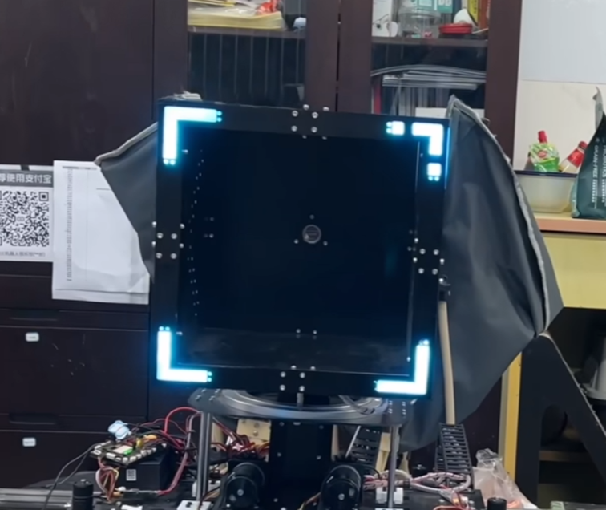
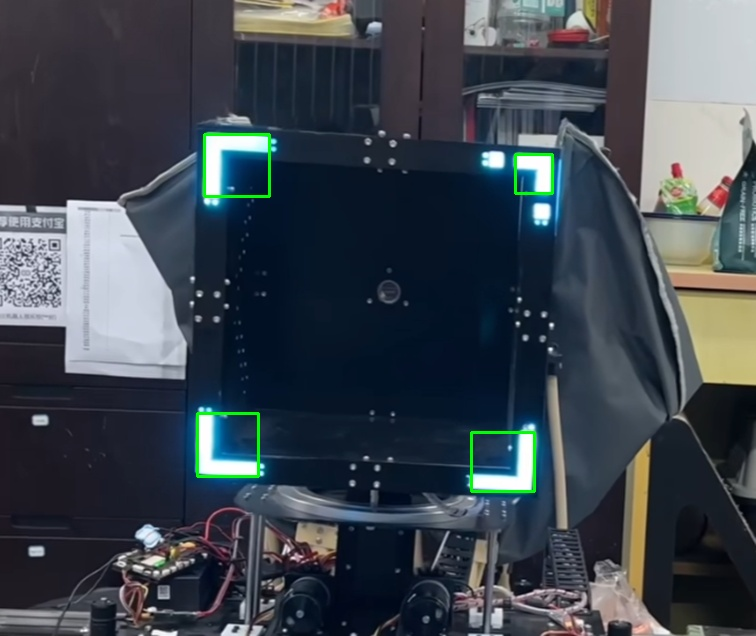

# OpenCV 最小框选与多边形拟合

这个项目要框选出下图的四个角上的亮部，并显示图像

## 环境配置

### 配置opencv

在终端输入以下指令

`pip install opencv-python`

## 实现思路

先通过掩码处理，提取高亮度

掩码如下所示：

| hsv | 下界  | 上界  |
|:---:|:---:|:---:|
|  h  |  0  | 255 |
|  s  |  0  | 255 |
|  v  | 245 | 255 |

再通过多边形拟合获取四个六边形

最后框选出图像

实现效果如下图

